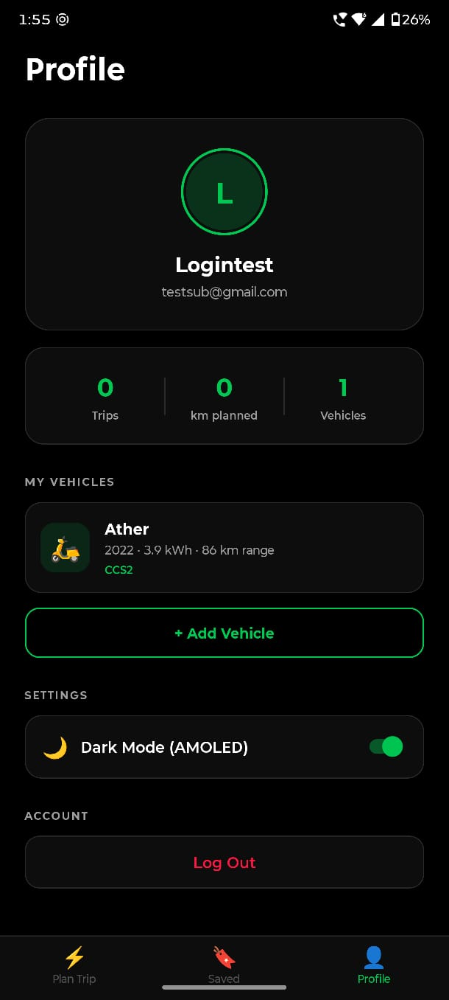
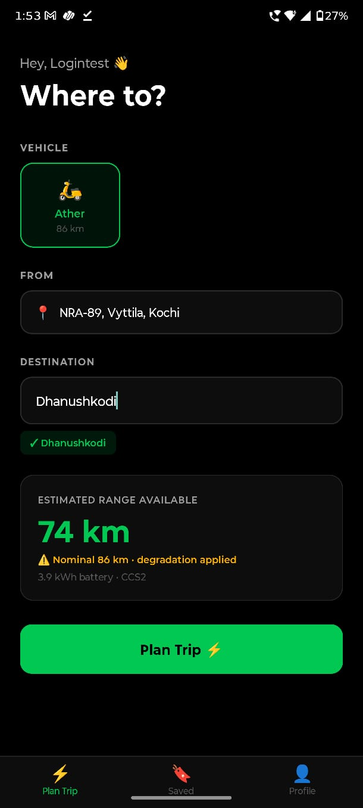
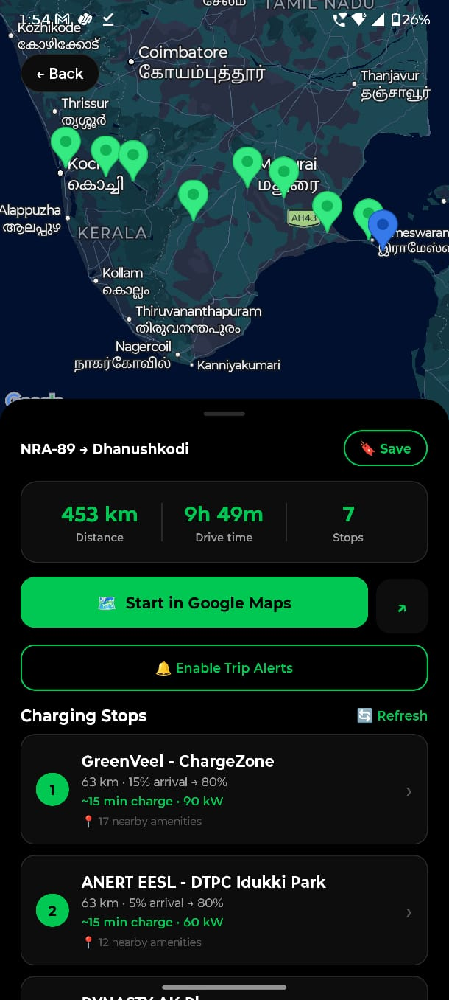
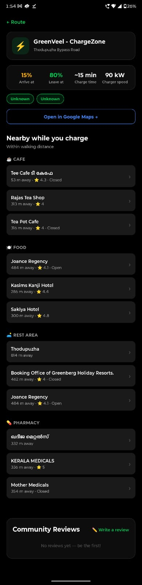

# EVidey ⚡

An EV trip planner built for Indian roads. Enter your destination, pick your vehicle, and EVidey calculates the optimal route with real charging stops, estimated charge times, nearby amenities, and hotel recommendations — all secured behind a Supabase backend proxy.

<p align="center">
  
</p>

---

## Screenshots

<p align="center">
  
  &nbsp;&nbsp;
  
  &nbsp;&nbsp;
  
  &nbsp;&nbsp;
  
</p>

---

## What is EVidey?

EVidey solves the range anxiety problem for EV drivers in India. Given an origin and destination, it:

1. Fetches the real driving route via Google Routes API
2. Computes how many charging stops are needed based on the vehicle's real-world range and battery health/mileage degradation
3. Finds actual charging stations near each required stop using Open Charge Map
4. Fetches amenities (food, cafes, pharmacies, hotels) near each charger
5. Displays the full trip plan — map, stop-by-stop battery estimates, charge time, connectors, and amenities

---

## Features

### Completed
- **Trip Planning** — Origin auto-detected via GPS, destination via Google Places autocomplete
- **Smart Charging Stop Routing** — Stop count calculated from vehicle range × 0.85 usable factor; distributes stops evenly along route
- **Battery Degradation Model** — Uses explicit `batteryHealthPercent` if provided, otherwise estimates from odometer (3% per 100,000 km, minimum 70%)
- **Real Charging Stations** — Live data from Open Charge Map, filtered by connector type, sorted by power (kW)
- **Sparse Infrastructure Fallback** — Widens search radius from 30 km to 60 km if no stations found nearby
- **Arrival/Departure Battery %** — Per-stop battery state computed from segment distance and effective range
- **Charge Time Estimation** — Based on kWh needed and station power rating; minimum 15 minutes enforced
- **Map View** — Google Maps with encoded polyline route, origin/destination/stop markers
- **Stop Detail Screen** — Full breakdown: connector types, power, address, arrival %, charge time, amenities
- **Nearby Amenities** — Cafes, restaurants, pharmacies, convenience stores within 500m of each charger
- **Hotel Recommendations** — For car users, hotels searched within 3 km of each stop
- **Amenity Distance** — Haversine distance computed client-side for each amenity
- **Multi-vehicle Support** — Add multiple EVs with full specs, switch between them per trip
- **Default Vehicle** — Set a default vehicle used automatically on the trip planner
- **Station Reviews** — Submit and view star ratings + comments for charging stations (stored in Firestore)
- **Saved Trips** — Save any planned trip; persisted to AsyncStorage
- **Offline Cached Trip** — Last planned trip cached locally for offline access
- **Trip Active Mode** — Real-time GPS tracking during a trip; proximity alerts when approaching a charging stop
- **Live Station Status Refresh** — Refresh operational status of stops on the active trip screen
- **Start in Google Maps** — Hands off the full route with waypoints to Google Maps navigation
- **Push Notifications** — Local proximity alerts (requires dev/production build, not Expo Go)
- **Dark / Light Mode** — Full theme support via `themeStore` + `useTheme` hook
- **Account System** — Email/password auth via Firebase Authentication
- **Google OAuth** — Sign in with Google via `expo-auth-session`
- **API Key Security** — All Google Maps and OCM keys proxied through Supabase Edge Functions; never bundled in the app

### To Do
- **Cloud sync for vehicles and saved trips** — Currently device-local (AsyncStorage only); needs Firestore sync so data survives reinstalls and works across devices
- **Google Maps key for dev build** — Key is embedded at native build time; clearing the key breaks map rendering in dev until rebuild
- **Connector filter UI** — `connectorFilter` param exists in `fetchChargingStations` but is not wired to a UI control
- **Production keystore SHA-1** — Add release signing SHA-1 to Google Cloud Console Android app restriction before publishing to Play Store

### Future Work
- **iOS support** — Currently Android-only (no iOS signing configured); needs `expo-dev-client` iOS build and Maps SDK for iOS key
- **Route deviation detection** — Re-route if user goes off the planned path
- **Station availability** — Real-time plug availability (requires OCPI-compatible network integration)
- **Cost estimation** — Estimate charging cost per stop based on tariff data
- **Community features** — Station photos, issue reports, upvotes on reviews
- **Widget / CarPlay** — Glanceable next-stop info on the home screen or in-car display
- **Battery SoC integration** — Pull live battery % from OBD-II adapter via Bluetooth

---

## Architecture

```
Client (React Native / Expo)
        │
        │  EXPO_PUBLIC_SUPABASE_URL + ANON_KEY (safe to bundle)
        ▼
Supabase Edge Functions (Deno, server-side)
        │
        ├── place-search        → Google Places Autocomplete / Details / Geocoding
        ├── compute-routes      → Google Routes API
        ├── nearby-places       → Google Places Nearby Search
        └── charging-stations   → Open Charge Map API
                │
                │  GOOGLE_MAPS_API_KEY (Supabase secret, never in app)
                │  OPEN_CHARGE_MAP_API_KEY (Supabase secret, never in app)
                ▼
        Third-party APIs

Client also calls Firebase directly:
        ├── Firebase Auth       → Email/password + Google OAuth
        └── Firestore           → Station reviews
```

**Map tile rendering** uses a separate Google Maps key (`EXPO_PUBLIC_GOOGLE_MAPS_API_KEY`) embedded in `AndroidManifest.xml` at build time, restricted to Maps SDK for Android + the app's package name and SHA-1.

---

## Tech Stack

| Layer | Technology |
|---|---|
| Framework | [Expo](https://expo.dev) SDK 56 (React Native) |
| Navigation | [Expo Router](https://expo.github.io/router) v4 (file-based) |
| Maps | `react-native-maps` with Google Maps provider |
| State Management | [Zustand](https://github.com/pmndrs/zustand) |
| Local Storage | `@react-native-async-storage/async-storage` |
| HTTP | Axios |
| Backend Proxy | [Supabase Edge Functions](https://supabase.com/docs/guides/functions) (Deno) |
| Auth | Firebase Authentication |
| Database | Cloud Firestore (reviews only) |
| Routing API | Google Routes API (via Supabase proxy) |
| Places API | Google Places API (via Supabase proxy) |
| Geocoding API | Google Geocoding API (via Supabase proxy) |
| Charging Data | [Open Charge Map API](https://openchargemap.org/site/develop/api) (via Supabase proxy) |
| Notifications | `expo-notifications` (local only) |
| Location | `expo-location` |
| Language | TypeScript |

---

## Project Structure

```
EVidey/
├── app/                        # Expo Router screens (file-based routing)
│   ├── _layout.tsx             # Root layout — auth gate, deep link handler
│   ├── index.tsx               # Entry redirect
│   ├── (auth)/                 # Unauthenticated screens
│   │   ├── login.tsx           # Email/password + Google sign-in
│   │   ├── register.tsx        # New account creation
│   │   └── vehicle-setup.tsx   # Add first vehicle after registration
│   └── (app)/                  # Authenticated screens
│       ├── (tabs)/             # Bottom tab navigator
│       │   ├── index.tsx       # Trip planner (main screen)
│       │   ├── profile.tsx     # Vehicle management + account
│       │   └── saved.tsx       # Saved trips list
│       └── trip/
│           ├── route.tsx       # Active trip map + stop list
│           └── stop-detail.tsx # Per-stop breakdown + amenities
│
├── services/                   # All external API and business logic
│   ├── routeService.ts         # planTrip() — orchestrates route + stops + amenities
│   ├── chargingService.ts      # fetchChargingStations(), fetchAmenitiesNearStation()
│   ├── locationService.ts      # GPS, Places autocomplete, geocoding
│   ├── firebaseService.ts      # Firebase auth + Firestore helpers
│   ├── reviewService.ts        # Station review CRUD (Firestore)
│   └── notificationService.ts  # Local push notifications for proximity alerts
│
├── store/                      # Zustand state stores
│   ├── authStore.ts            # User + vehicles (AsyncStorage backed)
│   ├── tripStore.ts            # Current trip, saved trips, planning state
│   ├── reviewStore.ts          # Station reviews (in-memory + Firestore)
│   └── themeStore.ts           # Dark/light theme preference
│
├── supabase/
│   └── functions/              # Edge Functions (deployed to Supabase)
│       ├── place-search/       # Google Places: autocomplete, details, geocode
│       ├── compute-routes/     # Google Routes API proxy
│       ├── nearby-places/      # Google Places Nearby Search proxy
│       ├── charging-stations/  # Open Charge Map proxy
│       └── _shared/cors.ts     # Shared CORS headers
│
├── constants/
│   ├── colors.ts               # Light/dark color scheme definitions
│   └── config.ts               # Supabase URL/key, edgeFunctionUrl(), edgeFunctionHeaders()
│
├── hooks/
│   └── useTheme.ts             # Returns current ColorScheme from themeStore
│
├── types/
│   └── index.ts                # All shared TypeScript types (Vehicle, TripPlan, etc.)
│
├── components/                 # Reusable UI components (map/, trip/, ui/)
├── assets/                     # Icons, splash screen, fonts
├── app.config.js               # Dynamic Expo config — injects Maps key into native build
├── eas.json                    # EAS Build profiles (development, preview, production)
└── .env                        # Local environment variables (never committed)
```

---

## Data Flow

### Trip Planning
```
User types destination
    → getPlaceSuggestions()  [place-search edge fn → Google Autocomplete]
    → user selects suggestion
    → getPlaceCoordinates()  [place-search edge fn → Google Place Details]
    → planTrip()
        → compute-routes edge fn → Google Routes API  (polyline + distance)
        → computeStopCoordinates()  (linear interpolation along route)
        → for each stop point:
            → charging-stations edge fn → Open Charge Map  (real stations)
            → nearby-places edge fn → Google Places  (amenities)
        → returns TripPlan
    → rendered on MapView + stop list
```

### Data Persistence
| Data | Storage | Scope |
|---|---|---|
| User profile + vehicles | AsyncStorage | Device-local |
| Saved trips | AsyncStorage | Device-local |
| Last trip cache | AsyncStorage | Device-local |
| Station reviews | Firestore | Cloud (all users) |
| Auth session | Firebase Auth | Cloud |

---

## Environment Variables

| Variable | Used For | Safe to Bundle? |
|---|---|---|
| `EXPO_PUBLIC_SUPABASE_URL` | Edge Function base URL | ✅ Yes |
| `EXPO_PUBLIC_SUPABASE_ANON_KEY` | Edge Function auth | ✅ Yes |
| `EXPO_PUBLIC_GOOGLE_MAPS_API_KEY` | Map tile rendering only | ⚠️ Yes, but restrict to Maps SDK for Android + app SHA-1 |
| `EXPO_PUBLIC_FIREBASE_*` | Firebase Auth + Firestore | ✅ Yes (Firebase uses domain restrictions) |
| `EXPO_PUBLIC_GOOGLE_WEB_CLIENT_ID` | Google OAuth | ✅ Yes |
| `GOOGLE_MAPS_API_KEY` | Supabase secret — Places, Routes, Geocoding | 🔒 Server only |
| `OPEN_CHARGE_MAP_API_KEY` | Supabase secret — OCM | 🔒 Server only |

---

## Getting Started

### Prerequisites
- Node.js 18+
- Android device or emulator with USB debugging enabled
- [Supabase account](https://supabase.com)
- [Firebase project](https://console.firebase.google.com)
- Google Cloud project with these APIs enabled: Maps SDK for Android, Places API, Routes API, Geocoding API

### 1. Clone & install
```bash
git clone https://github.com/Zentise/EVidey.git
cd EVidey
npm install
```

### 2. Set up environment variables
```bash
cp .env.example .env
```
Fill in `.env` with your Supabase URL/anon key, Google Maps key (map tiles), and Firebase config.

### 3. Deploy Supabase Edge Functions
```bash
supabase link --project-ref <your-project-ref>
supabase secrets set GOOGLE_MAPS_API_KEY=<server-key> OPEN_CHARGE_MAP_API_KEY=<ocm-key>
supabase functions deploy place-search
supabase functions deploy compute-routes
supabase functions deploy nearby-places
supabase functions deploy charging-stations
```

### 4. Build and run
```bash
npx expo run:android
```
> `npx expo start` alone will not render the map — the Google Maps key is embedded at native build time.

---

## License

MIT — see [LICENSE](LICENSE)
